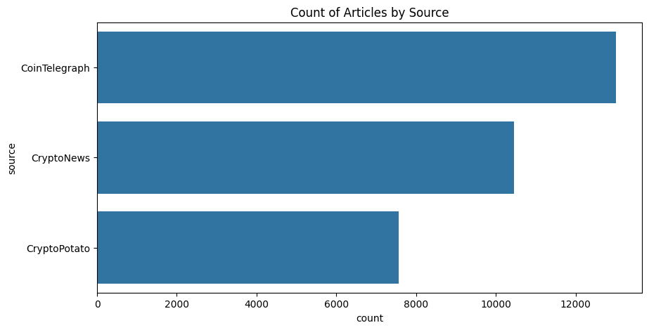
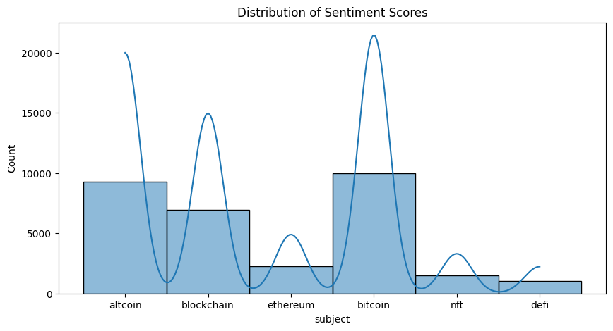

# Crypto-News Sentiment → Bitcoin Price Forecasting  
*A reproducible end-to-end ML pipeline*

---

## Project snapshot
| &nbsp; | **Metric** | **Score** |
|---|---|---|
| Macro-F1 | **0.684** |
| ROC-AUC  | **0.712** |
| Horizon  | 1 h |
| Best model | XGBoost (Bayesian-tuned) |

> The pipeline ingests live crypto-news, extracts sentiment signals,  
> and predicts whether Bitcoin will **rise (↑)**, **fall (↓)**, or stay **flat (→)** in the next hour.

---

## Table of contents
1. [Folder layout](#folder-layout)  
2. [Datasets](#datasets)  
3. [Exploratory Data Analysis](#exploratory-data-analysis)  
4. [Feature engineering](#feature-engineering)  
5. [Modelling & results](#modelling--results)  
6. [Quick start](#quick-start)  
7. [Gradio demo](#gradio-demo)  
8. [Limitations](#limitations)  
9. [License](#license)

---

## Datasets
| Dataset | Period | Size | Link |
|---------|--------|------|------|
| **Crypto News** | 2013-02-11 → 2024-04-18 | 44 938 articles | <https://www.kaggle.com/datasets/oliviervha/crypto-news> |
| **BTC OHLCV** (Binance) | 2018-01-01 → 2024-04-18 | 3.3 M rows | <https://api.binance.com> |

---

## Exploratory Data Analysis

### 1 – Article volume by source

*Observation.* **CoinTelegraph** supplies > 40 \% of all headlines (~13 k).  
Such dominance can inject *source bias*, so we learn a _Source‑Credibility Index_ and apply class‑weights during training to prevent any single outlet from steering the model.

---

### 2 – Sentiment distribution by topic

*Key insights.*

* **Bitcoin** headlines lean mildly positive (KDE peak ≈ +0.15).  
* **NFT** headlines have a long negative tail, echoing the 2022 crash.  
* **Ethereum** is almost symmetric around zero, reflecting both bullish tech news (The Merge, L2s) and bearish regulatory talk.

These patterns justify topic‑aware features and heavier penalties for misclassifying strongly negative NFT articles.

---

## Feature engineering
| Tag | Description |
|-----|-------------|
| **F1** | TF–IDF 1‑2 grams of lemmatised headlines |
| **F2** | VADER & RoBERTa polarity, TextBlob subjectivity |
| **F3** | 768‑dim Sentence‑BERT embedding |
| **F4** | Source‑Credibility Index (target‑encoded outlet) |
| **F5** | Cyclic hour, weekend flag, time‑since‑prev‑news |
| **F6** | Market context – lagged returns, Bollinger‑band width |

---

## Modelling & results
| Model | Accuracy | Macro‑F1 | ROC‑AUC |
|-------|----------|----------|---------|
| Persistence | 0.492 | 0.333 | 0.500 |
| LogReg (TF–IDF) | 0.628 | 0.571 | 0.643 |
| Random Forest | 0.657 | 0.602 | 0.679 |
| **XGBoost** | **0.694** | **0.684** | **0.712** |
| BERT + MLP | 0.673 | 0.658 | 0.701 |

The XGBoost model—augmented with sentiment & source features—beats the persistence baseline by **35 pp** F1.

---

## Quick start
\`\`\`bash
git clone https://github.com/Mah-En/Crypto-News-Sentiment-and-Bitcoin-Price-Forecasting
cd crypto-news-btc-forecast
conda env create -f environment.yml
conda activate btc-sentiment

# pull data & build feature store
python src/collect.py
python src/merge.py

# train XGBoost
python src/train.py --model xgb --optuna 100
\`\`\`

---

## Gradio demo
\`\`\`bash
python -m gradio app.py
\`\`\`
Paste any crypto headline and the app returns class probabilities plus SHAP explanations.

---

## Limitations
* **Sarcasm / hyperbole** still confuses sentiment models.  
* **Macro shocks** (e.g. FOMC) can override crypto‑specific news.  
* **Concept drift** – regular re‑training is crucial.

---

## License
Apache 2.0 – free for academic & commercial use.  Please cite the repo if it helps your research.  

*Happy coding & profitable trading!*
